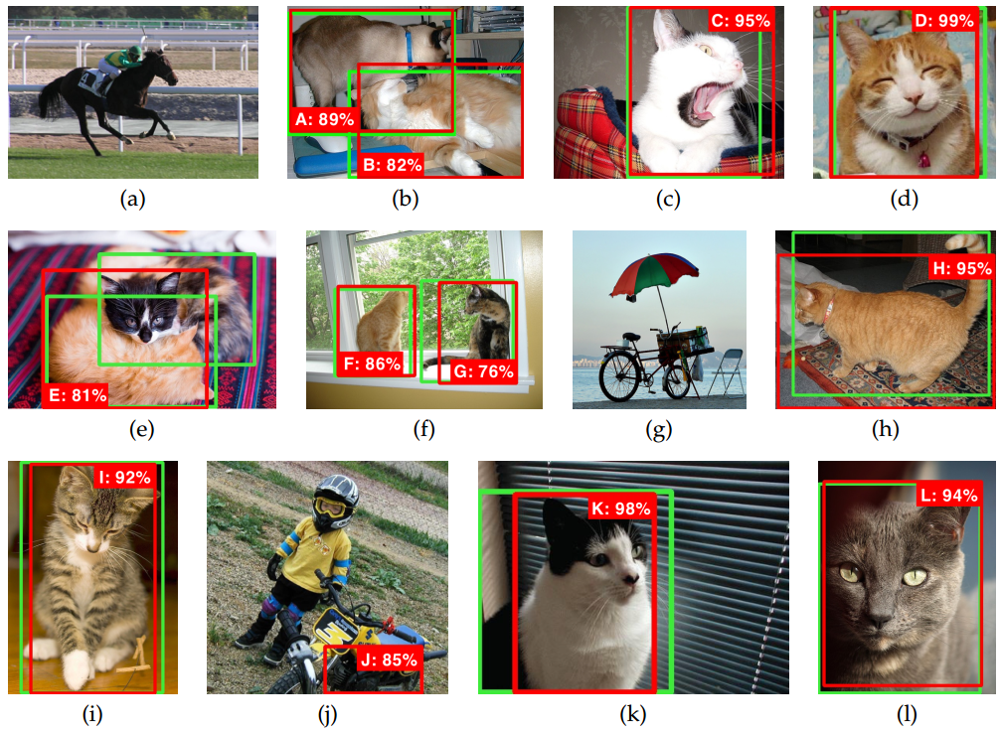
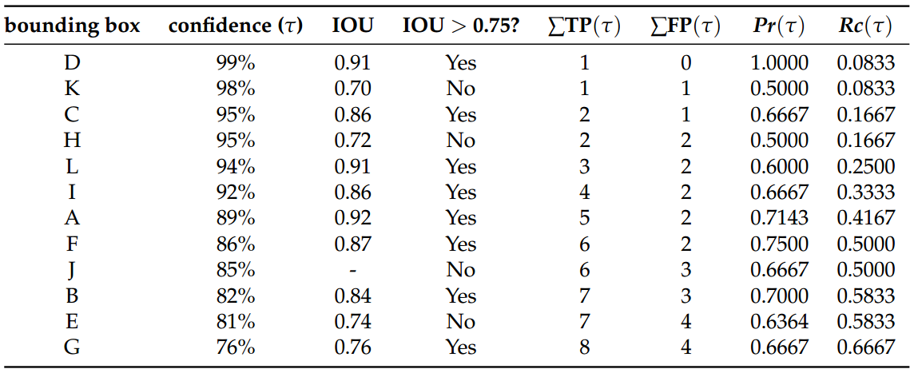
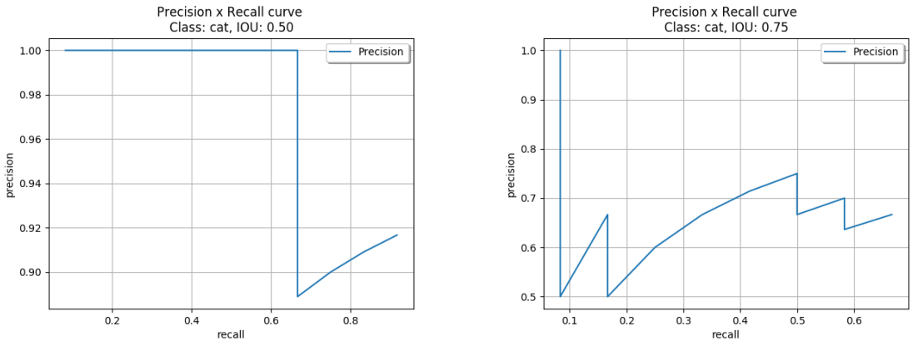

## Definition
The task of **classifying** and **localizing** multiple objects in an image is called *object detection*.

![[Pasted image 20240313204145.png]]
## Specification
To locate an object, we use a bounding box for each object, which contains 4 values, which can be either(depending on dataset/convention): 

1. (x1, y1, w, h)
2. (x1, y1, x2, y2)

Here (x1, y1) are co-ordinates of top-left corner of the box, (w,h) are the width and height of bounding box. (x2, y2) are co-ordinates of the bottom right corner of the box.

So the end result of the task should be 
$$\hat y = \{ ClassId, Confidence, BBoxInfo \} $$
## Stages 
1. Feature extraction
2. Classification
3. Detection/Localization

(Stage 1 + Stage 2) --> **Classification Stage**
(Stage 3) --> **Detection Stage**

Overview:

![[Pasted image 20240313222514.png]]
## Metrics

>[!INFO] Note about False Negatives
> There are no true negatives in a Computer Vision task. As we are fundamentally not interested in objects which are not present.

### [[Intersection Over Union(IoU)]]

### Overall Picture

![[Pasted image 20240313225650.png]]

A good detector can pick up all available ground truths($n_{FN}=0$) while avoiding to detect irrelevant objects($n_{FP}=0$).

The stricter the confidence threshold, the number of FP and TP predictions decrease, as we detect fewer and fewer objects overall.

![[Pasted image 20240313225004.png]]

Therefore, the stricter the threshold, the number of FN predictions goes up as well, as we don't detect a lot of relevant objects due to confidence requirement.

### Mean Average Precision

#### Precision

#### Recall

#### Average Precision

The AP is the approximation of the Area Under the Curve (AUC). This approximation involves interpolation that eliminates the noisy Precision vs Recall curve - effectively converting this curve to a monotonic curve.

![[Pasted image 20240313232855.png]]

![[Pasted image 20240313231143.png]]

The algorithm is as follows:
1. Order k different confidence values $\tau$ where $\tau (i) > \tau (j) \space \forall \space i > j$  
2. Since the recall values have a one-to-one monotonic correspondce with $\tau$, we sample it at discrete points, so the precision-recall curve ends up not being continous, but sampled at discrete points from $\tau$ to 1, leads us to a set of pairs: {Precision($\tau_k$ ), Recall($\tau_k$)}.
3.  Order the set of reference recall values $Recall_{REF}(n)$ s.t. $$recall_{REF}(m) < recall_{REF}(n)$$ for m > n.
4. The Average Precision(AP) is computed using the (2) and (3) values after interpolation.

#### Practical Example

Considering the set of 12 images in the figure below:

Each image, except (a), (g), and (j), has at least one target object of the class *cat*, whose locations are limited by the green rectangles.
There is a total of 12 target objects limited by the green boxes. Images (b), (e), and (f) have two ground-truth samples of the target class.
An object detector predicted 12 objects represented by the red rectangles (labeled with letters *A* to *L*) and their associated confidence levels are represented in percentages. Images (a), (g), and (j) are expected to have no detection. Conversely, images (b), (e), and (f) have two ground-truth bounding boxes.

To evaluate the precision and recall of the 12 detections it is necessary to establish an IOU threshold *t*, which will classify each detection as TP or FP.
In this example, let us first consider as TP the detections with *IOU > 50%*, that is *t=0.5*. We start by sorting the entries in descenting order of the confidence threshold. 

As stated before, AP is a metric to evaluate precision and recall in different confidence values. Thus, it is necessary to count the amount of TP and FP classifications given different confidence levels.

By choosing a more restrictive IOU threshold, different precision x recall values can be obtained. The following table computes the precision and recall values with a more strict IOU threshold of *t = 0.75*. By that, it is noticeable the occurrence of more FP detections, reducing the recall. 

Graphical representations of the precision x values presented in both cases *t= 0.5* and *t=0.75* are shown below:

By comparing both curves, one may note that for this example:

1) With a less restrictive IOU threshold (*t=0.5*), higher recall values can be obtained with the highest precision. In other words, the detector can retrieve about *66.5%* of the total ground truths without any miss detection.

2) Using *t=0.75*, the detector is more sensitive with different confidence values. This is explained by the amount of ups and downs of the curve.

3) Regardless the IOU threshold applied, this detector can never retrieve *100%* of the ground truths (recall = 1). This is due to the fact that the algorithm did not predict any bounding box for one of the ground truths in image (e).

Different methods can be applied to measure the AUC of the precision x recall curve. With the so-called *N-point interpolation* we calculate the interpolated AP values using $N$ recall reference points - for example for $N=11$:

$$[0, 0.1, 0.2, 0.3, 0.4, 0.5, 0.6, 0.7, 0.8, 0.9, 1.0]$$, 

In the *All-point interpolation* approach, all recall points are considered. These interpolation approaches result in different plots as shown below:

"

When an IOU threshold *t=0.5* was applied (plots of the first row in image above), the 11-point interpolation method obtained *AP=88.64%* while the all-point interpolation method improved the results a little, reaching *AP=89.58%*. Similarly, for an IOU threshold of *t=0.75%* (plots of the second row in image above), the 11-point interpolation method obtained *AP=49.24%* and the all-point interpolation *AP=50.97%*. 

In both cases, the all-point interpolation approach considers larger areas above the curve into the summation and consequently obtains higher results.
When a lower IOU threshold was considered, the AP was reduced drastically in both interpolation approaches. 

Please note that MS COCO AP results are reported with interpolation over $N=101$ points. 

In classification problems with multiple classes the mean AP is simply the sample mean of $AP(c), c \in \{1, \dots, C\}$ across the C classes.

## Methods

[[Sliding CNN approach]]
[[Object Detection using R-CNN]]

